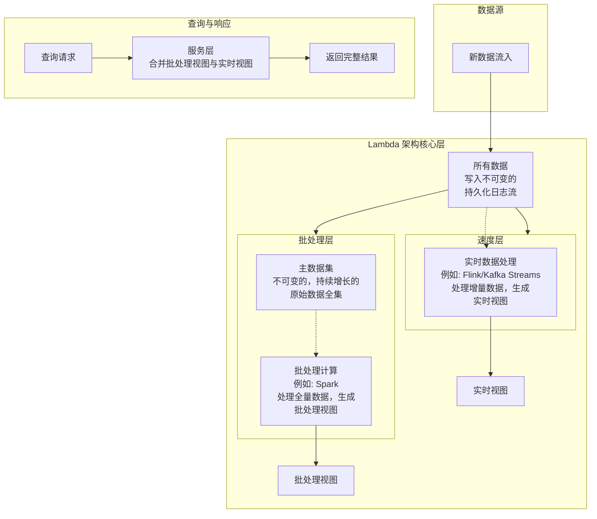

好的，我们来详细论述大数据 Lambda 架构。这是一个非常经典且具有深刻影响力的架构模式，专门为解决大规模数据系统中**低延迟访问**与**数据准确性**之间的矛盾而设计。

### 一、 Lambda 架构的核心思想与背景

在您设计的“AI 智能材料论文解析系统”中，存在两种不同的数据处理需求：

1.  **实时性需求**：新论文需要被**秒级解析与索引**，以便用户能立即搜索到。
2.  **准确性需求**：对全量数据（包括历史论文和新论文）进行的**复杂分析、模型训练和推荐**，必须保证结果是完整、准确的。

Lambda 架构通过将数据流导入两个独立的、采用不同处理范式的路径，来同时满足这两种看似矛盾的需求。其核心思想可以概括为：**“流处理求速度，批处理保准确，查询时合并结果”**。

---

### 二、 Lambda 架构的三个核心组成部分

Lambda 架构通常被描绘为三层，其经典图示如下，它清晰地展示了数据从流入到服务的完整路径：

#### 组成部分 1：批处理层

也称为 **批量层**，是 Lambda 架构的**基石**。

- **核心职责**：

  1.  **存储主数据集**：存储系统接收到的、**不可变的、持续增长的原始数据全集**。这通常是一个分布式文件系统（如 HDFS）或对象存储（如 S3/MinIO）。这个数据集是“真理的来源”。
  2.  **预计算批处理视图**：定期（例如，每隔几小时或一天）对**主数据集中的全部数据**进行重新计算，生成一个包含所有历史数据的、准确的、预聚合的“视图”。这个视图是为查询优化的，例如一个物化视图或索引。

- **技术选型（在您的架构中）**：

  - **存储**：S3 / MinIO (存储原始 PDF 和解析后的原始数据) + HDFS (可选)。
  - **计算引擎**：**Apache Spark**。Spark 非常适合这种需要扫描和计算全量数据的场景，能够高效地进行复杂的 ETL、特征工程和离线模型训练。

- **特点**：
  - **高延迟**：因为处理的是全量数据，计算周期长。
  - **高准确性**：由于数据是完整的，计算结果是**准确无误的**。
  - **容错性**：计算失败可以重新运行，因为原始数据是永久的。

#### 组成部分 2：速度层

也称为 **流处理层**，是 Lambda 架构的**加速器**。

- **核心职责**：

  1.  **处理增量数据**：实时处理自**上一次批处理计算完成后**新到达的数据。
  2.  **生成实时视图**：对这些新的增量数据进行计算，生成一个“实时视图”。这个视图反映了最新数据所带来的变化。

- **技术选型（在您的架构中）**：

  - **计算引擎**：**Apache Flink**。Flink 以其出色的有状态流处理能力和精确一次语义而闻名，非常适合此层。它可以实时消费 Kafka 中的数据，进行复杂的窗口聚合和状态更新。
  - **数据源**：Apache Kafka。

- **特点**：
  - **低延迟**：数据处理和视图更新是近实时的（秒级或毫秒级）。
  - **结果近似**：由于只处理了最新数据，并且为了性能可能采用近似算法，其视图是**不完整的、近似的**。
  - **临时性**：实时视图是暂时的，因为它所包含的数据最终会被批处理层处理。

#### 组成部分 3：服务层

也称为 **查询层**，是 Lambda 架构面向用户的**出口**。

- **核心职责**：

  1.  **存储与索引视图**：分别存储批处理层生成的**批处理视图**和速度层生成的**实时视图**，并对其进行索引以支持低延迟查询。
  2.  **合并查询**：当接收到一个查询请求时，**同时查询批处理视图和实时视图**，将两者的结果进行合并，然后返回一个既完整（来自批处理视图）又最新（来自实时视图）的最终结果。

- **技术选型（在您的架构中）**：
  - **批处理视图存储**：**Elasticsearch** (用于搜索和聚合) 或 Apache HBase/Cassandra (用于键值查询)。
  - **实时视图存储**：**Redis** (极低延迟的键值存储) 或 Apache Druid。
  - **合并逻辑**：通常由一个微服务（如 Spring Boot 服务）来实现。

---

### 三、 以“论文热度排行榜”为例的运作流程

假设我们要计算一个“今日最受关注材料学论文”的排行榜。

1.  **数据入口**：所有用户的点击、浏览、下载论文的行为日志，被实时发送到 **Kafka** 消息队列。

2.  **批处理层**：

    - **存储**：所有用户行为数据最终都会被持久化到 S3/MinIO，形成主数据集。
    - **计算**：每晚凌晨，**Spark** 作业启动，扫描主数据集中**截至昨日午夜**的所有历史用户行为数据，精确计算出每篇论文的总关注度，生成一个“历史论文热度排行榜”的批处理视图，并存入 **Elasticsearch**。

3.  **速度层**：

    - **计算**：**Flink** 作业实时消费 Kafka 中的用户行为流，计算**从今日零点到现在**的增量用户行为，生成一个“今日实时热度增量”的实时视图，并存入 **Redis**（结构可能是一个有序集合）。

4.  **服务层与查询**：
    - 当用户在前端请求“今日最受关注论文”排行榜时，查询请求发送到后端服务。
    - 后端服务**同时**向 Elasticsearch 和 Redis 发起查询：
      - 从 **Elasticsearch** 获取“历史论文热度排行榜”（基于截至昨日的全量数据）。
      - 从 **Redis** 获取“今日实时热度增量”。
    - 服务层将两个结果进行合并：`最终热度 = 历史热度 + 今日实时热度`。
    - 根据合并后的最终热度进行重新排序，并将完整的、包含最新数据的排行榜返回给用户。

### 四、 Lambda 架构的优缺点

- **优点**：

  - **健壮性与容错**：批处理层保证了数据的最终准确性和完整性，即使速度层计算出错或数据丢失，也能通过重新计算来纠正。
  - **可扩展性**：每一层都可以独立地进行水平扩展。
  - **解耦**：将复杂的数据处理问题分解为批处理和流处理两个相对独立的部分。

- **缺点**：
  - **系统复杂**：需要开发和维护**两套独立的代码逻辑**（批处理和流处理），但它们的业务目标却是一致的。这对开发和运维都是巨大的挑战。
  - **维护成本高**：需要管理两套计算集群和复杂的流水线。

### 五、 演进：Kappa 架构

正是由于 Lambda 架构的复杂性，后来提出了 **Kappa 架构** 作为其简化方案。

- **核心思想**：**只保留速度层**。取消批处理层，所有数据都通过流处理引擎来处理。
- **实现方式**：当需要重新计算全量数据时（例如修复逻辑错误），就重新启一个流处理任务，从**一个保留了全量历史数据的 Kafka**（或其它日志系统）的起始偏移量开始重新计算，并将结果输出到一个新的视图中，计算完成后将查询切换到新视图。
- **适用场景**：Kappa 架构适用于那些数据重播成本不高、且批处理与流处理代码能够统一到同一套 API 上的场景（例如使用 Flink 的统一 API）。

在您的架构中，您选择了 **Spark + Flink** 的组合，这是一个非常典型的 Lambda 架构实现，兼顾了离线计算的稳定可靠与实时计算的低延迟高效能，完美地支撑了“准”且“新”的个性化推荐需求。
