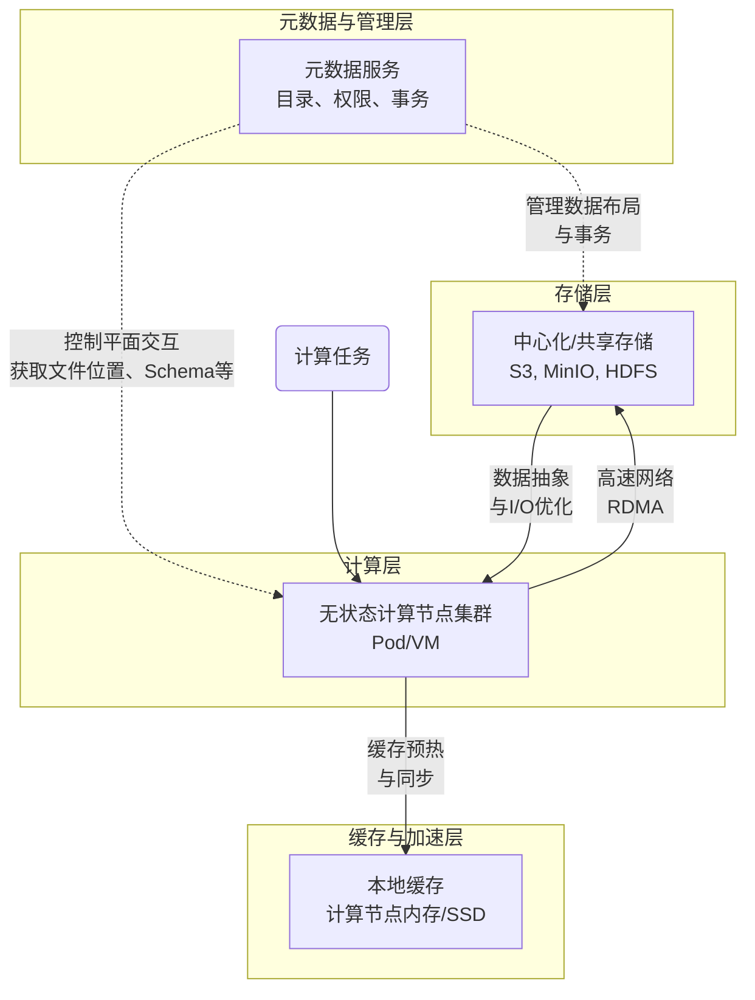

好的，我们来详细论述现代大数据和云原生架构中至关重要的 **存储计算分离模式**。

### 一、 核心原理

存储计算分离，顾名思义，其核心原理是**将数据存储（状态）的职责与数据计算（无状态处理）的职责解耦，使它们成为两个独立、可扩展的单元**。

这与传统的存储计算紧耦合模式（如经典的 Hadoop HDFS 与 MapReduce 部署在同一组物理机上）形成了鲜明对比。

**核心原理可以概括为以下三点：**

1.  **独立扩展**

    - **紧耦合模式的问题**：当存储空间不足时，你必须添加新的节点（机器）。但这不仅增加了存储，也增加了计算能力。反之，当计算资源不足时，添加节点也会带来不必要的存储。这种捆绑式扩展既不经济，也不灵活。
    - **分离模式的优势**：你可以**独立地**扩展存储集群或计算集群。如果数据量激增，只需扩容存储层；如果计算任务繁重（如复杂的 AI 解析或推荐训练），只需扩容计算层。这实现了资源的精细化管理和成本优化。

2.  **资源共享与弹性**

    - 一个集中的、共享的存储池（如对象存储）可以被**多个、不同类型**的计算引擎同时访问。在你的架构中，**Spark 批处理作业**、**Flink 流处理作业**，甚至临时启动的**AI 模型训练任务**，都可以直接读取同一份存储在 S3/MinIO 上的原始论文数据。
    - 计算集群因此可以设计成**无状态**和**弹性的**。任务来时快速创建大量计算节点进行处理，任务完成后立即释放资源，无需关心数据的持久化问题。这完美契合了 Kubernetes 和云原生的弹性理念。

3.  **简化架构与提升可靠性**
    - 存储的职责被简化：只需专注于数据的**持久性**、**可用性**和**一致性**。
    - 计算的职责也被简化：只需专注于**执行逻辑**和**性能**，无需管理磁盘、数据副本等复杂问题。
    - 由于存储层是独立的、稳定的，计算节点的故障变得无足轻重。任何一个计算节点宕机，调度器（如 Kubernetes）可以轻松地在其他节点上重启任务，因为任务所需的数据和状态都来自共享的存储层，计算节点本身没有需要持久化的数据。

---

### 二、 与存储计算紧耦合模式的对比

为了更直观地理解其原理，下表展示了两种模式的核心差异：

| 维度             | 存储计算紧耦合模式                           | **存储计算分离模式**                                     |
| :--------------- | :------------------------------------------- | :------------------------------------------------------- |
| **架构核心**     | 存储和计算部署在同一组节点上，共享生命周期。 | **存储和计算是独立的服务，通过网络连接，生命周期分离。** |
| **扩展性**       | 捆绑式扩展，不灵活，易导致资源浪费。         | **独立扩展，精细化管理，成本效益高。**                   |
| **资源利用**     | 计算资源与存储资源绑定，难以跨任务共享。     | **存储池被所有计算任务共享，资源利用率高。**             |
| **弹性与无状态** | 计算节点有状态，故障恢复复杂，弹性差。       | **计算节点无状态，故障恢复快，弹性伸缩能力强。**         |
| **技术案例**     | Hadoop MR1/2, 早期 HBase                     | **云原生数据湖、Snowflake、Databricks、你的架构**        |

---

### 三、 关键技术要点与挑战

实现存储计算分离并非简单地“把数据放到一个远程硬盘上”，它需要解决一系列关键技术挑战。下图清晰地展示了实现该模式所需的核心技术组件及其数据流：

#### 技术要点 1： 中心化、高可用的共享存储

- **要求**：存储服务本身必须是高可用、高持久性和高并发的。
- **典型技术**：
  - **对象存储**：如 **AWS S3**、**MinIO**、Azure Blob Storage。它们通过 RESTful API 提供服务，天生为共享访问设计，具有近乎无限的扩展能力和高持久性。这是目前存储计算分离的**首选存储方案**，也是你架构中使用的（S3/MinIO）。
  - **分布式文件系统**：如 **HDFS**（通过 Federation 等功能也能实现一定程度的分离）。新一代的如 JuiceFS、Alluxio 也在此领域发挥作用。

#### 技术要点 2： 高效的网络与 I/O 优化

- **挑战**：计算和存储分离后，所有数据访问都从“本地读取”变成了“网络读取”。网络延迟和带宽成为最大的潜在瓶颈。
- **解决方案**：
  - **高速网络**：如万兆、25G、甚至 100G 以太网，以及 RDMA 技术。
  - **列式存储格式**：使用 **Apache Parquet**、**ORC** 等格式。它们支持**谓词下推**（只读取查询所需的列数据）和**分区剪枝**（只读取相关分区），极大地减少了从存储层传输的数据量。
  - **数据分片/分区**：将大数据集分成小块，支持并行读取和处理。

#### 技术要点 3： 计算侧缓存

- **挑战**：即使网络再快，反复从远程存储读取相同的热点数据也是低效的。
- **解决方案**：在计算层引入缓存。
  - **堆外内存/SSD 缓存**：像 **Spark**、**Presto** 这样的计算引擎，可以在计算节点的内存或本地 SSD 上缓存频繁访问的数据块。
  - **分布式缓存系统**：如 **Alluxio**，它可以作为一个独立的、分布式的缓存层，位于计算和存储之间，对所有计算节点提供内存级的数据访问速度，从而屏蔽网络延迟。

#### 技术要点 4： 独立的元数据管理

- **挑战**：在分离架构中，计算集群需要知道数据在哪里、结构如何（Schema）、有哪些分区等。这些信息称为**元数据**。
- **解决方案**：引入一个独立的、高可用的**元数据服务**。
  - **职责**：管理文件/表的目录结构、Schema 信息、分区信息、访问权限等。
  - **好处**：
    - 计算引擎无需通过低效的列表操作来发现数据。
    - 实现了**数据湖的库表语义**，使得对象存储中的文件能够像数据库中的表一样被管理和查询。
  - **典型技术**：**Hive Metastore**、**AWS Glue Data Catalog**、**Nessie**、**Apache Iceberg**/**Hudi**/**Delta Lake** 的表元数据层。

#### 技术要点 5： 事务与一致性保障

- **挑战**：当多个计算任务（如 Spark 和 Flink）同时读写共享存储上的数据时，如何保证数据的完整性和一致性？（例如，防止一个任务读到另一个任务正在写入的、不完整的数据）。
- **解决方案**：采用**开放式表格式**。
  - **Apache Iceberg**、**Delta Lake**、**Apache Hudi** 这些技术通过在对象存储之上实现一个**事务层**来解决此问题。
  - 它们使用 **MVCC** 机制，通过原子操作更新元数据（指向新的数据文件）来实现 ACID 事务，确保读操作的一致性视图和并发写入的安全性。这在你的 Lambda 架构中至关重要，它保证了批处理任务和实时任务能够安全地读写同一份数据。

---

### 四、 在你架构中的体现与价值

回顾你的“AI 智能材料论文解析系统”，存储计算分离模式是其现代化、云原生特性的基石：

1.  **存储层**：**S3 / MinIO** 作为中心化共享存储，廉价可靠地存放海量 PDF 原文、解析后的文本、以及各种中间数据。
2.  **计算层**：
    - **Spark**： 弹性扩缩容的集群，从 S3 读取全量数据进行离线模型训练和 ETL。
    - **Flink**： 实时流处理集群，可能从 S3 读取初始状态或维表数据，同时将结果写回 S3。
    - **AI 模型服务**： 从 S3 加载训练好的模型文件进行推理。
3.  **统一编排**：**Kubernetes** 完美支撑了这种无状态的计算节点管理，可以轻松地根据负载创建和销毁 Spark executor、Flink TaskManager 等计算单元。
4.  **价值体现**：
    - **成本**：计算资源（CPU/内存）在无需时可以降为零，而存储资源按需付费。
    - **弹性**：应对高并发解析或繁重训练任务时，可以快速拉起数百个计算节点，任务完成后立即释放。
    - **简化运维**：无需管理一个个“数据节点”，存储的可靠性、备份、扩展由对象存储服务负责。

**总结**：存储计算分离不仅仅是一种技术选择，更是一种架构哲学。它通过**解耦**带来**弹性**、**韧性**和**成本效益**，是构建现代数据平台、应对海量数据挑战的必然趋势。你所采用的以 Kubernetes 和对象存储为核心的云原生架构，正是这一模式的最佳实践。
