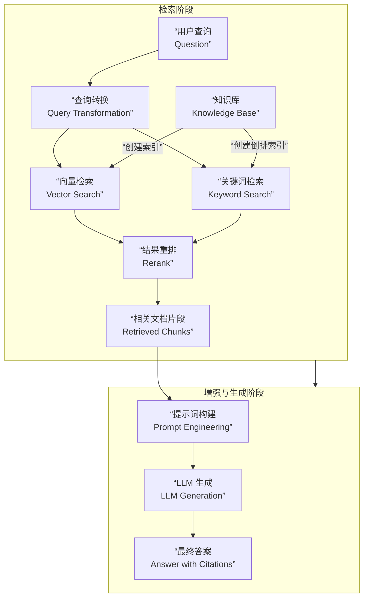

好的，我们来详细论述当前生成式 AI 领域至关重要的 **RAG 技术**。RAG 有效地将信息检索与大型语言模型相结合，解决了 LLM 固有的痛点，如**幻觉、知识过时和无法溯源**。

### 一、 RAG 的核心原理

**RAG 的核心思想可以概括为：在 LLM 生成答案之前，先从外部知识库中检索相关信息，然后将这些信息作为上下文，与用户问题一并提供给 LLM，从而指导 LLM 生成更准确、更可靠的答案。**

其工作流程可以清晰地分为检索、增强和生成三个核心阶段，下图展示了这一过程的数据流与核心组件：



**一个简单的比喻：**
想象一个开卷考试。

- **没有 RAG 的 LLM**：像一个闭卷考试的学生，只能依靠记忆（训练数据）作答，容易答错或编造。
- **有 RAG 的 LLM**：像一个开卷考试的学生。拿到问题（**检索**）后，他先去翻阅教科书和笔记（**外部知识库**），找到相关的章节和内容（**相关文档**），然后结合自己的理解（**LLM 的能力**），组织成一份准确的答案（**生成**）。

**RAG 解决了 LLM 的哪些核心问题？**

1.  **知识幻觉**：通过提供事实依据，让 LLM 的回答有所本，减少胡编乱造。
2.  **知识过时**：知识库可以随时更新，让 LLM 能够获取最新的、训练数据中不存在的信息。
3.  **透明性与可溯源**：答案可以引用来源，用户可以核对原始文档，增强信任。
4.  **处理专有/私有数据**：LLM 本身不了解公司内部的文档、代码等私有信息，RAG 使其能够基于这些信息作答。

---

### 二、 关键实现环节

#### 环节一：知识库构建

这是 RAG 系统的基石，决定了系统能力的上限。此环节的目标是将原始的非结构化文档（如你的材料科学论文 PDF）转换为便于检索的、结构化的知识片段。

- **1. 数据加载**

  - **内容**：从多种来源获取数据，如 PDF、Word、HTML、Markdown、数据库等。
  - **技术**：使用文档加载器（如 LangChain 的 `DocumentLoader`），自动解析文件并提取文本和元数据（如来源、作者、日期）。

- **2. 文档分块**

  - **为什么？** 长文档（如一篇完整的论文）不适合直接检索和作为上下文。需要将其切分成更小的、语义完整的“块”。
  - **分块策略**：这是关键决策点。
    - **固定大小分块**：最简单的方重叠，以保持上下文连贯性。
    - **基于分隔符的分块**：根据自然分隔符（如标题、段落、句号）进行分割。
    - **语义分块**：使用 NLP 模型识别语义边界（如主题变化处）进行分块，更智能但更复杂。
    - **针对论文的特定策略**：
      - 按章节分块（摘要、引言、方法论、实验结果、结论）。
      - 将图表及其标题和描述作为独立的块。

- **3. 向量化与索引**
  - **向量化**：使用**文本嵌入模型**将每个文本块转换为一个高维向量（例如 768 或 1536 维）。这个向量在数学上代表了文本的**语义**。语义相似的文本，其向量在空间中的距离也更近。
  - **索引**：将所有文本块的向量及其对应的原文和元数据，存储到一个专门的**向量数据库**中，并建立高效的索引结构，以便后续进行快速相似性搜索。

#### 环节二：检索策略

当用户提出问题后，系统需要从知识库中找出最相关的信息片段。

- **1. 查询转换**

  - **目的**：优化用户原始查询，使其更适合检索。
  - **技术**：
    - **查询重写**：使用 LLM 对问题进行同义改写、扩展或简化。
    - **HyDE**：让 LLM 根据问题**生成一个假设性的答案**，然后用这个假设答案的向量去检索。这种方法能更好地捕捉查询的“意图”，而非仅仅是字面匹配。

- **2. 检索器**

  - **核心：向量检索**
    - **原理**：将用户查询也转换为向量，然后在向量数据库中进行**相似性搜索**（如余弦相似度），找出与查询向量最接近的 Top-K 个文本块。
    - **优势**：基于**语义**匹配，即使查询和文档没有相同的关键词，但只要意思相关就能被检索到。
  - **补充：混合检索**
    - **原理**：结合**向量检索**和**传统关键词检索**。后者使用 BM25 等算法，擅长精确匹配关键词。
    - **为什么？** 对于一些特定术语（如材料名称 “MXene”、方法名 “DFT”），关键词检索非常精准。结合两者可以取长补短。
    - **实现**：分别进行两种检索，然后对结果进行融合。

- **3. 后处理与重排**
  - **目的**：初步检索出的 Top-K 个结果可能包含冗余或不完全相关的内容，需要进一步精炼。
  - **技术**：
    - **去重**：移除内容高度重复的块。
    - **重排模型**：使用一个更小、更专精于相关性判断的模型（如 Cross-Encoder）对检索出的所有文档进行重新打分和排序，只保留最相关的少数几个片段传递给 LLM。这能显著提升最终答案的质量，并减少上下文窗口的浪费。

#### 环节三：生成与答案合成

这是最终呈现给用户的环节。

- **1. 提示词工程**

  - **目的**：将检索到的上下文和用户问题组合成一个清晰的指令，交给 LLM。
  - **提示词模板**：一个典型的 RAG 提示词结构如下：

    ```
    你是一个专业的材料科学助手。请严格根据以下提供的上下文信息来回答问题。如果答案不在上下文中，请明确说明“根据已知信息无法回答”。

    <上下文>
    {这里插入经过重排后的相关文档片段}
    </上下文>

    <问题>
    {这里是用户的问题}
    </问题>

    请给出答案，并务必在答案中引用相关的上下文编号，例如【1】。
    ```

- **2. LLM 生成**

  - LLM 根据精心构建的提示词，生成最终答案。由于提供了相关上下文，LLM 的生成过程更可控、更准确。

- **3. 溯源**
  - 在答案中明确标注出哪些信息来源于哪个文档块（例如通过上文的 `【1】`），让用户可以回溯到原始资料进行验证。这是建立信任的关键。

---

### 三、 高级演进与在您系统中的应用

**RAG 的进阶方向：**

- **迭代检索**：LLM 在生成过程中，如果发现初始检索的信息不足，可以自主提出新的查询进行多轮检索。
- **智能路由**：判断问题类型（简单 QA、总结、多步推理），并路由到不同的检索策略或甚至不检索（直接回答）。
- **RAG Fusion**：根据原始问题生成多个相关查询，分别检索后再合并结果，以获得更全面的信息。

**在您的“AI 智能材料论文解析系统”中的应用设想：**

1.  **知识库构建**：
    - 您的 AI 解析流水线输出的结构化信息（论文摘要、实验方法、材料属性、结论等）是构建 RAG 知识库的**绝佳原料**。
    - 分块策略可以针对论文结构进行深度优化。
2.  **检索策略**：
    - 可以结合**向量检索**（语义上查找相似研究）和**关键词检索**（精确查找特定材料或方法）。
    - 利用元数据（发表年份、期刊、作者）进行**过滤**，确保检索结果的新颖性和权威性。
3.  **生成与问答**：
    - 为用户提供一个强大的 **“论文知识问答”** 界面，用户可以自然语言提问，如“总结一下近几年在钙钛矿太阳能电池稳定性方面的主要改进策略”，系统能基于已解析的海量论文生成有据可循的综述性答案。

**总结：** RAG 技术通过 **“检索-增强-生成”** 的范式，将 LLM 的强大生成能力与外部知识库的准确性和时效性相结合，是构建可信、可靠、专业级 AI 应用的核心架构。它完美地契合了您系统中处理海量、专业材料科学文献的需求。
